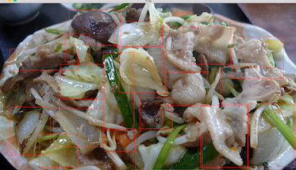

## 概要
ObjectDetectionのPoC向け簡易ラベリングツールです。pythonとopenCV2環境で動作します。

## 領域づけ
### スクリプト起動
```bash
$ make_area_data.py <image_dir>
```
**<image_dir>: 領域づけしたい画像があるディレクトリへのパス**

### 操作方法
* 起動すると画像がopencvで表示され、操作が開始できます
* マウスのクリックを押した時と離した時の座標でrectangleを生成します  
  * key("O")で領域をアノテーションに追加します  
  * "b,q,n"意外のキーを押せば作った領域は消され、やり直すことができます  
* key("b")でこれまで追加したアノテーションの座標を./area_annotations/<画像名>.jsonに保存します
* key("n")でjsonに保存せず次の画像へいきます
* key("q")でシステムを終了します  


## 領域にラベルを付与
* 現状は./class_list.txtに記載されている8クラスのラベル付けにしか対応していません
### スクリプト起動
```bash
$ make_label_data.py <image_dir>
```
**<image_dir>: 領域づけした画像があるディレクトリへのパス**

### 操作方法
* 起動すると画像がopencvで表示され、操作が開始できます
* make_area_data.pyで生成したannotationのjsonファイルを読んで、領域を個々に表示します
* 作業者は領域の中にある物体を目で見てclass_list.txtに記載されたどの番号の物体であるかを判断して、対応した番号の数字キーを押します
* 数字キーが押されると囲われた領域にラベルが付与され、次の領域へと進みます
* 全ての入力が終了すると結果がpascalVOC形式に変換され./annotations/<画像名>.xmlに保存されます

## 学習用データセット生成
```bash
$ convert_dataset.py <dataset_name> <image_dir_path> <cls_num>
```
**<dataset_name>: 生成するデータセットのパスとデータセット名**
* ex. ~/frcnn_data/trial2014_0225
* データセットへのパスやデータセット名のディレクトリが存在しなくても自動で生成します  

**<image_dir_path>: アノテーションをした画像があるディレクトリへのパス**
* 上記<image_dir> = <image_dir_path>/<dirname>であり、<image_dir_path>は<image_dir>の一段上までのパスを意味します
* このようにすることでラベル付けされた<image_dir_path>/*/*.jpgを全て読み込みます  

**<class_num>: 認識クラス数**
* category.txtを作成するために用います
